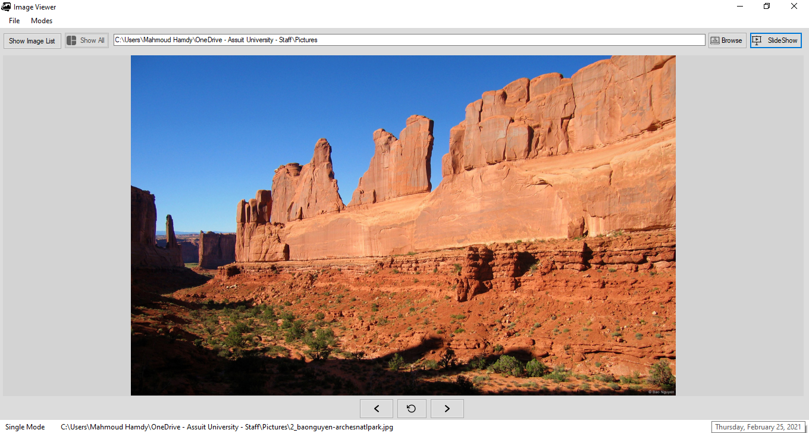
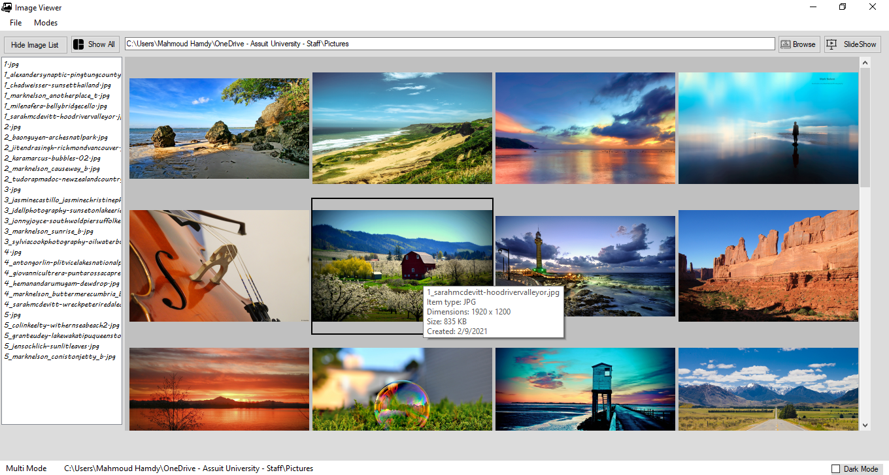
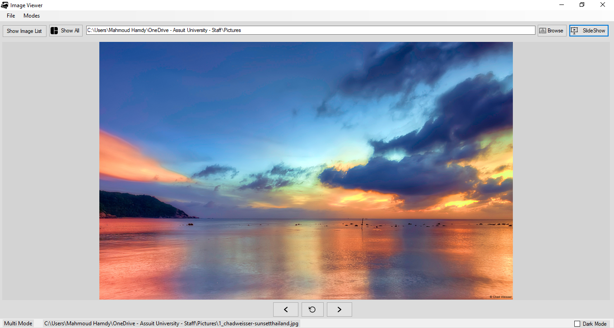
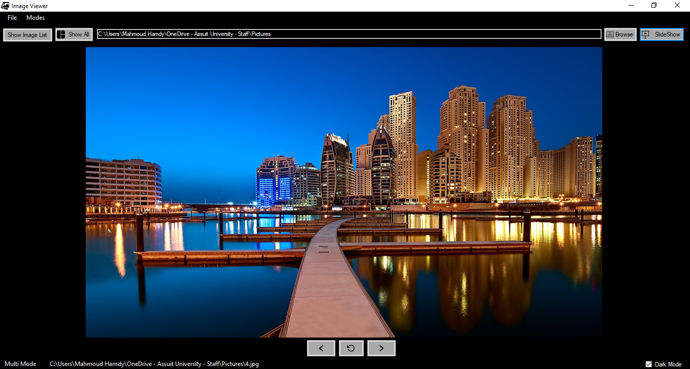
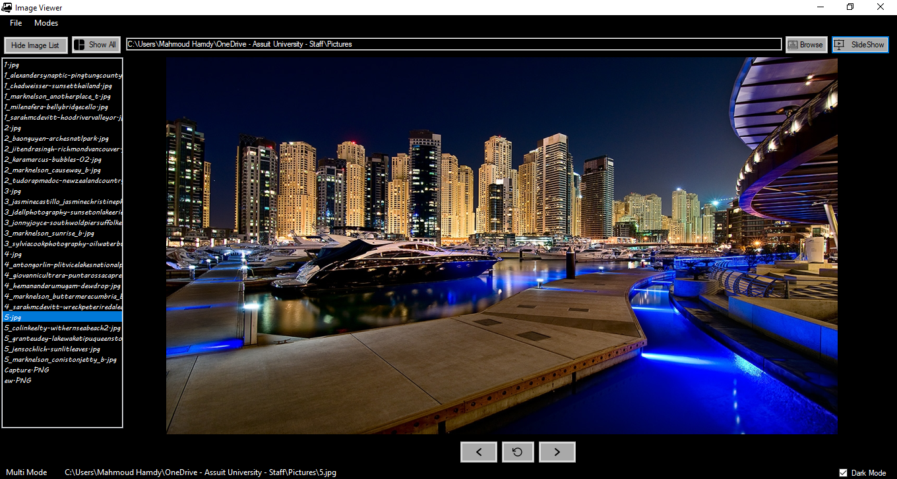
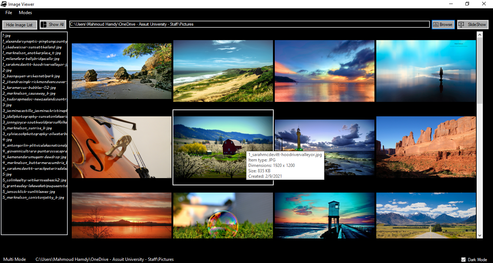
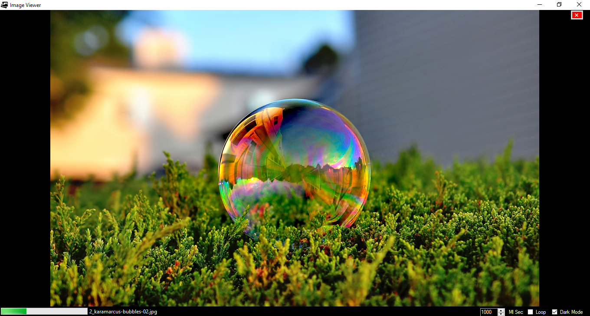

# imageViewer
This is a desktop application to browse images.

the Program has three modes the user can select between them:
1. **Single Mode** - *show only one image at a time*
2. **Multi Mode** - *show a grid of selected images*
3. **SlideShow** - *show all image one after another*

* It also supports dark mode

# Here's some screenshots from the Program:
* Light Mode  
  * **Single Mode**

  * **Multi Mode** 

  * **SlideShow**

  * **About Me**

* Dark Mode  
  * **Single Mode**

  * **Multi Mode** 

  * **SlideShow**

  * **About Me**

